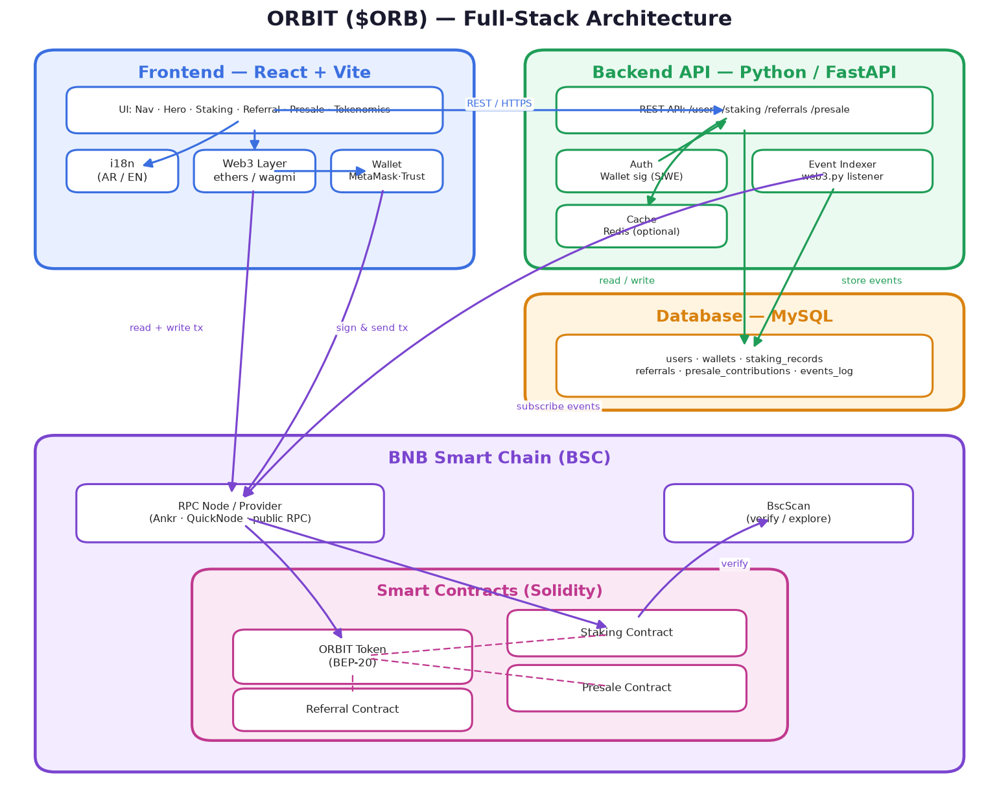
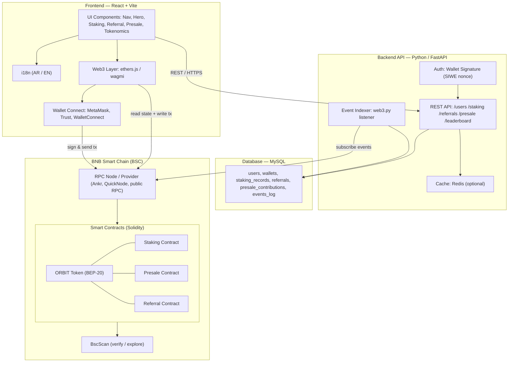

# ORBIT ($ORB) — Architecture / الهيكل المعماري

ORBIT is a **referral + staking dApp on BNB Smart Chain (BSC)**. Today the repo is
the **frontend** (React + Vite landing page). This document describes the **target
full-stack architecture** — how the Frontend, Backend, Smart Contracts, Blockchain
and Database fit together as the project grows into a real dApp.

> ORBIT هو تطبيق لامركزي للإحالة والـ staking على شبكة BNB. هذا المستند يوضح الهيكل
> المعماري الكامل: الواجهة الأمامية + الخادم + العقود الذكية + البلوكشين + قاعدة البيانات.



## Diagram (Mermaid)



## Layers

### 1. Frontend — React + Vite (موجود حاليًا)
The existing UI (`src/components/`): `Nav`, `Hero`, `HowItWorks`, `Staking`,
`ReferralForm`, `Tokenomics`, `PledgeRules`, `PriceGoal`, `Interactive`,
`Background`, `Logo`, `Footer`, with bilingual `i18n.js` (AR / EN).
**To be added** for the dApp: a **Web3 layer** (`ethers.js` or `wagmi`) and
**Wallet Connect** (MetaMask, Trust Wallet, WalletConnect) so users can connect a
wallet, stake, claim, and join the presale.

### 2. Web3 / Wallet layer
Bridges the browser and the blockchain. It lets the user **sign** messages (for
login) and **sign & send transactions** (stake, claim, buy presale). Reads of
on-chain state (balances, staking position) go directly through the RPC provider.

### 3. Backend API — Python / FastAPI
Handles everything that **doesn't belong on-chain**:
- **REST API**: `/users`, `/staking`, `/referrals`, `/presale`, `/leaderboard`.
- **Auth**: wallet-signature login (SIWE — Sign-In With Ethereum, nonce challenge),
  no passwords.
- **Event Indexer**: a `web3.py` worker that subscribes to contract events
  (`Staked`, `Claimed`, `ReferralPaid`, `Contributed`) and mirrors them into MySQL.
- **Cache**: optional Redis for fast leaderboard / stats responses.

### 4. Smart Contracts — Solidity (BSC)
| Contract | Purpose |
| --- | --- |
| **ORBIT Token (BEP-20)** | The $ORB token: supply, transfers, allowances. |
| **Staking** | Lock $ORB, accrue rewards, claim / unstake. |
| **Referral** | Track referrers, pay referral bonuses. |
| **Presale** | Sell $ORB during the presale, track contributions. |
Deployed & verified on **BscScan**; tooling: Hardhat or Foundry.

### 5. Blockchain — BNB Smart Chain
Transactions and contract state live on **BSC**. The app reaches the chain through
an **RPC provider** (Ankr, QuickNode, or the public BSC RPC). **BscScan** is used
to verify contract source and let users inspect transactions.

### 6. Database — MySQL (SQL layer)
Stores **off-chain** and **indexed** data for fast queries and analytics:

```sql
users                 -- id, wallet_address, created_at, referred_by
wallets               -- id, user_id, address, chain_id, label
staking_records       -- id, user_id, amount, reward, staked_at, unstaked_at, tx_hash
referrals             -- id, referrer_id, referee_id, bonus_amount, paid, created_at
presale_contributions -- id, user_id, amount_bnb, tokens, tx_hash, created_at
events_log            -- id, contract, event_name, block_number, tx_hash, payload(JSON)
```

The **single source of truth for money is the blockchain**; MySQL is a fast,
queryable mirror (built by the indexer) plus app data (profiles, leaderboards).

## Data flow — Read vs Write
- **Read (state):** Frontend → RPC → Contracts (live balances/positions), **or**
  Frontend → FastAPI → MySQL (aggregated stats, leaderboard, referral history).
- **Write (actions):** Frontend builds tx → **user signs in wallet** → RPC → BSC.
  The contract emits an event → **Indexer** catches it via RPC → writes to MySQL →
  the API serves the updated data back to the UI.

## Tech-stack summary
| Layer | Technology |
| --- | --- |
| Frontend | React 18 + Vite, i18n (AR/EN) |
| Web3 / Wallet | ethers.js / wagmi + WalletConnect, MetaMask, Trust |
| Backend | Python · **FastAPI** (+ web3.py indexer, optional Redis) |
| Smart Contracts | Solidity (BEP-20) — Hardhat / Foundry |
| Blockchain | **BNB Smart Chain (BSC)** + RPC provider + BscScan |
| Database | **MySQL** |

> Note: The Web3 layer, backend, contracts and database are the **next build
> phases** — this is the target architecture, not yet-implemented code. The current
> repo contains the React + Vite frontend only.
